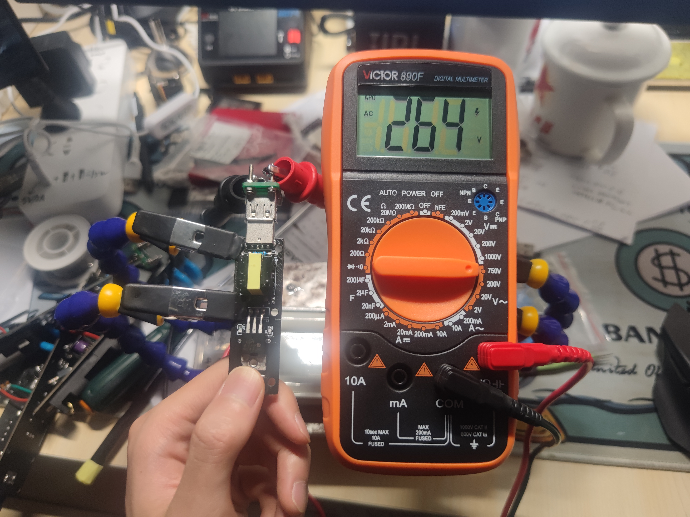
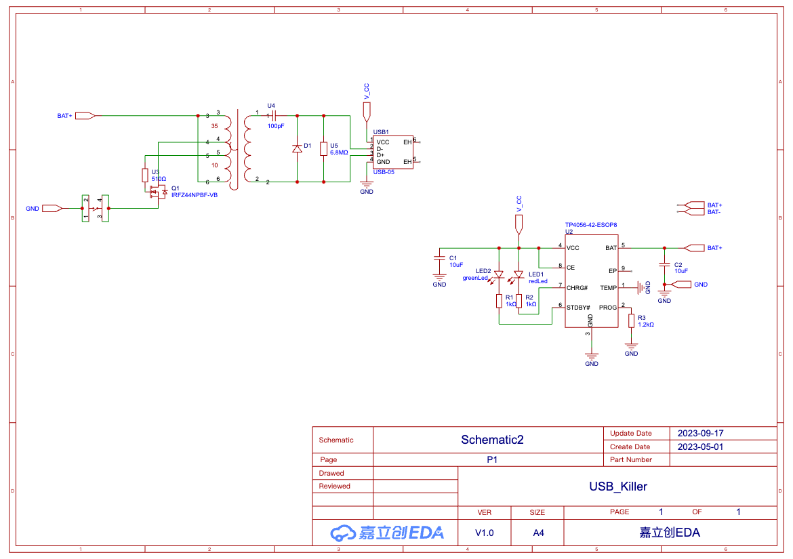

  
  
<h1 align="center">
  usb killer
</h1>

Welcome to the world of high voltage

_This project is sponsored by [SUSTech-EE201-17L](https://nces.cra.moe/course/286/) as a DIY project._ 

      

---

# What is a USB Killer?
Here in this repo, USB Killer is a device that can output hundreds of voltage to damage the circuits below USB port.

This version of Killer could drop about **260V** AC RMS votalge, which means it can drop about **360V** AC peak voltage

By changing the boosting part of circuit and using power 40C Panasonic 18650, we can easily get about **3kV**. (1mm electrical spark in air is about 3kV)

# How build your own USB-Killer
## Schematic
The schematic is drawed using JLC eda, you can [view the killer schematic on oshwHub](https://oshwhub.com/drinktoomuchsax/usb_killer_ac-version) or below.

## PCB 
You can use [the gerber file](killerGerber.zip) to manufacture the pcb
## BOM

**All the thing you needs before soldering**

| Name                  | Value                                       | Purchase link | Comment |
| --------------------- | ------------------------------------------- | ------------- | ------- |
| Capacitor(0603)       | 10uF\*2, 100pF\*1                           | [taobao]()    |         |
| Resistor(0603)        | 1k ohm\*2,1.2k ohm\*1                       | [taobao]()    |         |
| LED(0805)             | RED\*1, GREEN\*1                            | [taobao]()    |         |
| Transistor            | IRFZ44NPBF\*1                               | [taobao]()    |         |
| Switch                | TS665TP 250gf 013c                          | [taobao]()    |         |
| Transformer           | diy type on taobao                          | [taobao]()    |         |
| Power management chip | TP4056                                      | [taobao]()    |         |
| USB port              |                                             | [taobao]()    |         |
| Diode                 | DO_1N4007                                   | [taobao]()    |         |
| Battery               | any lipo battery under 200mha would be fine | [taobao]()    |         |

## Soldering

Follow this map to solder.
## Test

Before you plug the killer into some usb port, youd better try it on some metal conductor by using the USB_typrB to human adapter.

# How this works
It quite simple, just a Self-oscillation circuit and[ a voltage boost circuit](https://en.wikipedia.org/wiki/Voltage_doubler).

So we get some changing voltage in the self-oscillation circuit and amplify the changing voltage through the transformer. And we even boost it higher in the output through a voltage boost circuit.

This is how.
# TO-DO

- [ ] redesign the pcb making it both circuits board and shell
- [x] writing a doc

# Q&A
**Is this safe to human?**
> yes, i have test the killer on myself and lots of my friends. It just hurts a lot, but no obvious burning scar left

**Can I turn the design into even more powerful one?**  
> yes, the output voltage could be easily boost into thousands of voltage by using more powerful battery and add more boost circuits
